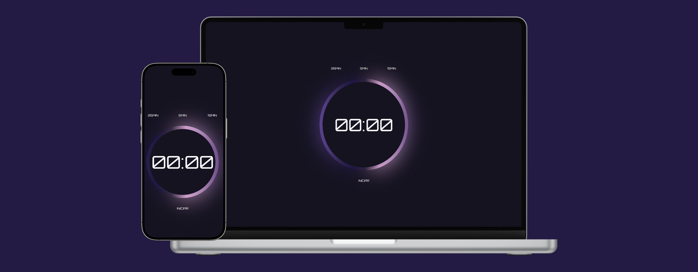

# Pomodoro Timer

Este projeto é um temporizador baseado na Técnica Pomodoro, que ajuda na gestão do tempo e aumento da produtividade. **[Link do projeto](https://davirrocha.github.io/pomodoro/)**

## Funcionalidades

- Temporizador de 25 minutos para foco

- Pausa curta de 5 minutos

- Pausa longa de 15 minutos

- Botões para iniciar, pausar, continuar e reiniciar o temporizador

- Notificação sonora ao término do tempo

- Pausa automática quando a aba do navegador perde o foco

## Tecnologias Utilizadas

- HTML

- CSS

- JavaScript